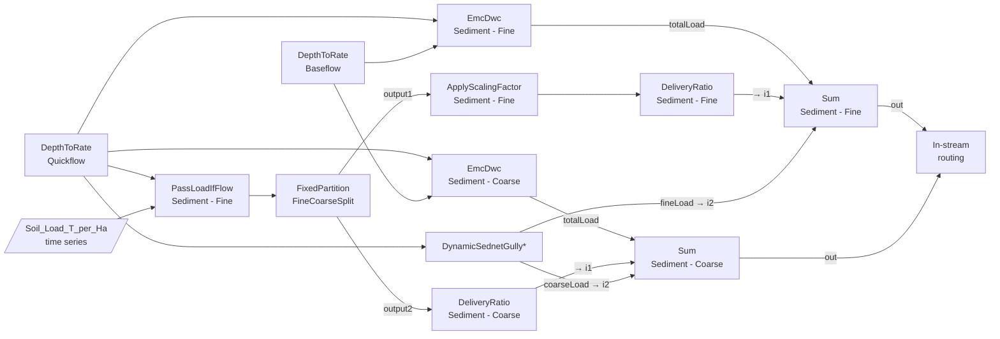

# Source → OpenWater model cheat sheet (Dynamic SedNet)

Where did my Source model go in OpenWater?

In Source, one constituent generation model per FU/constituent often bundles several processes, e.g. *Cropping Sediment (Sheet & Gully)* does hillslope *and* gully erosion. OpenWater keeps each process as its own node and wires them together in the graph. It also replaces several Source "load model" types with small graphs of generic functions (`PassLoadIfFlow`, `ApplyScalingFactor`, `DeliveryRatio`, `FixedPartition`, `Sum`).

So there's rarely a one-to-one answer. The right OpenWater node depends on **which parameter you want to set** or **which output you want to read**.

Everything here comes from the migration code in `dsed/migrate/build.py` (parameters), `dsed/ow/structure.py` (graph structure) and `dsed/ow/standard_reports.py` (reporting). When in doubt, check those files.

## General conventions

* **Node tags.** Every node carries tags you can filter on: `catchment`, `cgu` (the Source FU), `constituent` and `process`. A common pattern is to pick the model type, filter by `cgu`/`constituent`, then go by `process` if you need to:
  ```python
  results.time_series('DeliveryRatio', 'output', 'catchment',
                      cgu='Dryland Cropping', constituent='Sediment - Fine')
  ```
* **Units.** Generation outputs are **rates in kg/s**, even where a spec says `kg`. Multiply by 86400 for kg/day.
* **Percentages vs fractions.** Source delivery ratios are in %. When they map onto a generic `DeliveryRatio`/`ApplyScalingFactor` node, the migration divides by 100. When they map onto a SedNet-specific model (gully `sdrFine`, USLE `usleHSDRFine`, particulate `hillDeliveryRatio`), they **stay in %**.
* **Parameter names.** The migration strips `_` from Source column names and then matches them to OpenWater parameter names exactly. Only the explicit renames are listed below. Anything else passes through only if the names already match.
* **Area.** FU area goes to `DepthToRate.area`, `PassLoadIfFlow.scalingFactor`, `DynamicSednetGully[Alt].Area`, `SednetParticulateNutrientGeneration.area` and `USLEFineSedimentGeneration.area`.
* **Gully flavour.** `GULLYmodel.gullyModelType` in Source picks the OpenWater node type: `DERM RATIO` (the default) → `DynamicSednetGullyAlt`, `SEDNET POWER` → `DynamicSednetGully`. Both have identical parameters and outputs. Below, `DynamicSednetGully*` means whichever one your model uses.

---

## Cropping Sediment (Sheet & Gully) - GBR

Source class: `GBR_DynSed_Extension.Models.GBR_CropSed_Wrap_Model`. Applies to *Sediment - Fine* and *Sediment - Coarse* on cropping FUs, i.e. FUs that have a `Soil_Load_T_per_Ha` cropping time series.

### Mini-DAG (per catchment × cropping FU)



`Sum.i1` has two incoming links: the hillslope time-series load *and* the DWC load. OpenWater adds together all links arriving at the same input.

**The time-series nodes only exist for FUs that have a cropping soil loss time series** (`Soil_Load_T_per_Ha`; these FUs are listed in `meta['timeseries_sediment']`, often just Sugarcane). Other FUs using this Source model get only `EmcDwc` + `DynamicSednetGully*` → `Sum`.

**Filtering on missing dimensions.** OpenWater drops a dimension from a model type when every node of that type has the same value for it. For example, if only Sugarcane has `DeliveryRatio` nodes, `DeliveryRatio` has no `cgu` dimension, and `time_series(..., cgu='Sugarcane')` fails with `Invalid dimension`. Leave that tag off. `res.dims_for_model(model)` lists the filters a model accepts.

**Getting the budget with the generic results functions:**
```python
res = results.results   # OpenwaterDynamicSednetResults -> OpenwaterResults

# Daily series (kg/s), one column per catchment
surface = res.time_series('DeliveryRatio', 'output', 'catchment', constituent='Sediment - Fine')  # no cgu dim when only one FU has these nodes
subsurf = res.time_series('EmcDwc', 'totalLoad', 'catchment', cgu='Sugarcane', constituent='Sediment - Fine')
gully   = res.time_series('DynamicSednetGullyAlt', 'fineLoad', 'catchment', cgu='Sugarcane')
total   = res.time_series('Sum', 'out', 'catchment', cgu='Sugarcane', constituent='Sediment - Fine')

# Total over the run: catchments x FUs. Multiply by 86400 to get kg.
total_table = res.table('Sum', 'out', 'catchment', 'cgu',
                        temporal_aggregator='sum', constituent='Sediment - Fine')
```

For FUs with time-series nodes, `surface + subsurf + gully == total`.

### Parameters

| Source parameter (`_` stripped) | OpenWater node (`constituent`) | OW parameter | Conversion |
|---|---|---|---|
| `HillSlopeFinePerc` | `FixedPartition` (process `FineCoarseSplit`) | `fraction` | ÷ 100 |
| `LoadConversionFactor` | `ApplyScalingFactor` (Sediment - Fine) | `scale` | none (**fine only**) |
| `HillslopeFineSDR` | `DeliveryRatio` (Sediment - Fine) | `fraction` | ÷ 100 |
| `HillslopeCoarseSDR` | `DeliveryRatio` (Sediment - Coarse) | `fraction` | ÷ 100 |
| `HillslopeFineDWC` | `EmcDwc` (Sediment - Fine) | `DWC` | none. EMC isn't set. |
| `HillslopeCoarseDWC` | `EmcDwc` (Sediment - Coarse) | `DWC` | none. EMC isn't set. |
| `GullyYearDisturb` | `DynamicSednetGully*` | `YearDisturbance` | |
| `AverageGullyActivityFactor` | `DynamicSednetGully*` | `averageGullyActivityFactor` | |
| `GullyManagementPracticeFactor` | `DynamicSednetGully*` | `managementPracticeFactor` | missing → 1 |
| `GullySDRFine` / `GullySDRCoarse` | `DynamicSednetGully*` | `sdrFine` / `sdrCoarse` | **stays in %**, missing → 100 |
| other gully columns | `DynamicSednetGully*` | same name | pass through if names match. Anything else missing → 0 |
| FU area | `PassLoadIfFlow` / `DynamicSednetGully*` | `scalingFactor` / `Area` | m² |
| `gullyModelType` | *(chooses the node type)* | | see [General conventions](#general-conventions) |

**Input time series:**

| Source time series | OpenWater node | OW input | Conversion |
|---|---|---|---|
| Cropping `Sediment - Fine$Soil_Load_T_per_Ha$<catchment>$<fu>` | `PassLoadIfFlow` (Sediment - Fine) | `inputLoad` | t/ha/day → kg/m²/s |
| Gully `Annual Load For <catchment> <fu>` | `DynamicSednetGully*` | `annualLoad` | |
| Gully `Annual Runoff For <catchment> <fu>` | `DynamicSednetGully*` | `AnnualRunoff` | |

### Outputs / budget elements

| Source result | OpenWater node (`constituent`) | Output |
|---|---|---|
| **Total** generated load for the FU | `Sum` (process `ConstituentGeneration`) | `out` |
| **Gully**, delivered | `DynamicSednetGully*` | `fineLoad` / `coarseLoad` |
| **Gully**, generated (before SDR) | `DynamicSednetGully*` | `generatedFine` / `generatedCoarse` |
| **Hillslope surface soil**, delivered (from the time series) | `DeliveryRatio` (Fine / Coarse) | `output` |
| **Hillslope surface soil**, before SDR | Fine: `ApplyScalingFactor` `output` (includes the load conversion factor). Coarse: `FixedPartition` `output2` |
| **Hillslope sub-surface soil** (DWC × baseflow) | `EmcDwc` (Fine / Coarse) | `totalLoad` (= `slowLoad`, since EMC isn't set) |
| All hillslope (surface + sub-surface) | `Sum` | `i1` |
| Raw cropping sediment time series × area (before the fine/coarse split) | `PassLoadIfFlow` | `outputLoad` |

Particulate nutrients on these FUs take their "sheet" sediment from `ApplyScalingFactor.output` (fine) and `FixedPartition.output2` (coarse), and their gully sediment from `DynamicSednetGully*.generatedFine/Coarse`.

---

## Other constituent generation models

### Sediment Generation (USLE & Gully) - SedNet
`Dynamic_SedNet.Models.SedNet_Sediment_Generation` →
**`USLEFineSedimentGeneration`** (hillslope) + **`DynamicSednetGully*`** (gully) → **`Sum`** (per sediment class).

* **Parameters:** these go to USLE with `_` stripped. Explicit renames are `Max_Conc`→`maxConc`, `USLE_HSDR_Fine`→`usleHSDRFine` and `USLE_HSDR_Coarse`→`usleHSDRCoarse` (the last two stay in %). The gully parameters are the same as for Cropping Sediment.
* **Time series:** `KLSC_Total`→`KLSC`, `KLSC_Fines`→`KLSC_Fine` and `C-Factor`→`CovOrCFact`, all on `USLEFineSedimentGeneration`.
* **Outputs:**
  * Hillslope: `USLEFineSedimentGeneration.totalFineLoad` feeds `Sum.i1` for fine. For coarse, it's `quickLoadCoarse` → `Sum.i1`. `generatedLoadFine`/`generatedLoadCoarse` give the load before the SDR.
  * Gully: the same outputs as for Cropping Sediment.
  * Total: `Sum.out`.

### Sediment Generation (EMC & Gully) - SedNet
`Dynamic_SedNet.Models.SedNet_EMC_And_Gully_Model` →
**`EmcDwc`** (one per sediment class) + **`DynamicSednetGully*`** → **`Sum`**.

* **Parameters:** `fineEMC`/`fineDWC` → `EmcDwc` `EMC`/`DWC` (Sediment - Fine). `coarseEMC`/`coarseDWC` go to Sediment - Coarse the same way. Gully parameters are as above.
* **Outputs:** hillslope comes from `EmcDwc.totalLoad` (→ `Sum.i1`), gully from `DynamicSednetGully*.fineLoad/coarseLoad` (→ `Sum.i2`), and the total from `Sum.out`.

### EMC/DWC
`RiverSystem...EmcDwcCGModel` → **`EmcDwc`**. `eventMeanConcentration`→`EMC` and `dryMeanConcentration`→`DWC`. Outputs are `quickLoad`, `slowLoad` and `totalLoad`.

### Dissolved Nutrient Generation - SedNet
`SedNet_Nutrient_Generation_Dissolved` → **`SednetDissolvedNutrientGeneration`**, except on the `Water` FU, where it becomes `EmcDwc`. Outputs are `quickflowConstituent`, `slowflowConstituent` and `totalLoad`.

### Particulate Nutrient Generation - SedNet
`SedNet_Nutrient_Generation_Particulate` → **`SednetParticulateNutrientGeneration`**. FUs that don't use this model in Source get `EmcDwc`. The OpenWater node takes the hillslope and gully **sediment** loads as linked inputs, so it only works if the sediment nodes above are present.

* **Outputs:**
  * Hillslope: `hillslopeContribution`
  * Gully: `gullyContribution`
  * DWC: `slowflowConstituent`
  * Total: `totalLoad`
* **Parameters:** `hillDeliveryRatio` and `gullyDeliveryRatio` stay in %.

### TimeSeries Load Model - SedNet
`Dynamic_SedNet.Models.SedNet_TimeSeries_Load_Model` → mini-DAG:
`PassLoadIfFlow` → `ApplyScalingFactor` → `Sum.i1`, plus `EmcDwc` → `Sum.i2`. `Sum.out` is the total.

* **Parameters:**
  * `ApplyScalingFactor.scale` = `Load_Conversion_Factor × DeliveryRatio / 100`
  * DWC/EMC go to `EmcDwc`.
* **Outputs:**
  * Time-series component, delivered: `ApplyScalingFactor.output`
  * Before scaling: `PassLoadIfFlow.outputLoad`

The same mini-DAG is used for particulate P on cropping FUs other than Sugarcane.

### Dissolved Nitrogen TimeSeries Load Model - GBR
`GBR_DynSed_Extension.Models.GBR_DIN_TSLoadModel` → mini-DAG. It has a surface path and a leached/seepage path:

* **Surface:** `PassLoadIfFlow` (driven by quickflow) → `ApplyScalingFactor` → `Sum.i1`. Scale = `Load_Conversion_Factor × DeliveryRatioSurface / 100`.
* **Leached:** `PassLoadIfFlow` (constituent `NLeached`, driven by baseflow) → `ApplyScalingFactor` (`NLeached`) → `Sum.i2`. Scale = `Load_Conversion_Factor × DeliveryRatioSeepage / 100`.
* **DWC:** `EmcDwc` → `Sum.i2`.
* **Outputs:**
  * Total: `Sum.out`
  * Seepage (leached + DWC): `Sum.i2`
  * Surface, delivered: `ApplyScalingFactor.output` (N_DIN)

### Dissolved Phosphorus Nutrient Model - GBR
`GBR_DynSed_Extension.Models.GBR_DissP_Gen_Model` → **`EmcDwc`**. **There is no one-to-one parameter mapping.** The migration **precomputes `EMC`** in Python from `phos_saturation_index`, `ProportionOfTotalP`, `Load_Conversion_Factor` and `DeliveryRatioAsPercent`. To change any of those, recompute the EMC. See `build.py`.

### Pesticide time series load (GBR)
`GBR_DynSed_Extension.Models.GBR_Pest_TSLoad_Model` → `PassLoadIfFlow` → `Sum.i2`, plus `EmcDwc` → `Sum.i1`. On non-cropping FUs, only `EmcDwc` is used.

* **No scaling node.** The dissolved and particulate time series are scaled and combined in Python before the model is written: `(dissolved × DeliveryRatioDissolved + particulate × DeliveryRatio × Fine_Percent) × Load_Conversion_Factor`. The result goes into `PassLoadIfFlow.inputLoad`. Changing those parameters means regenerating the input time series.

### Blank / Nil constituent models
`SedNet_Blank_Constituent_Generation_Model` and `NilConstituent` → **no node**. The `Water/lakes` FU gets no generation nodes at all.

---

## Runoff

`DynSedNet_RRModelShell` (wrapping Sacramento/Simhyd) → **`Sacramento`** or **`Simhyd`** (process `RR`, tagged `hru`). Each FU also gets three **`DepthToRate`** nodes (process `ArealScale`, `component` = `Runoff` / `Quickflow` / `Baseflow`), which convert mm to m³/s using the FU area.

For FU runoff *volumes*, read `DepthToRate.outflow` filtered on `component`. For depths, read the runoff model's outputs directly.

## In-stream (link) models

| Source model | OpenWater node(s) | Notes |
|---|---|---|
| Storage Routing | `Lag` (process `FlowLag`) → `StorageRouting` | the lag is often a no-op |
| In Stream Fine Sediment Model - SedNet | **`InstreamFineSediment` + `BankErosion`** | Bank erosion is a separate node. Its `bankErosionFine`/`bankErosionCoarse` outputs feed `reachLocalMass`. Bank parameters (e.g. `RiparianVegPercent`, `SoilErodibility`, `BankFullFlow`, `LinkSlope`) are applied to **both** nodes. Floodplain/channel deposition: `loadToFloodplain`, `loadToChannelDeposition`. |
| In Stream Coarse Sediment Model - SedNet | `InstreamCoarseSediment` | gets `bankErosionCoarse` |
| In Stream Dissolved Nutrient Model - SedNet | `InstreamDissolvedNutrientDecay` | gets `floodplainDepositionFraction` from `InstreamFineSediment` |
| In Stream Particulate Nutrient Model - SedNet | `InstreamParticulateNutrient` | `partNutConc`→`particulateNutrientConcentration`. Gets bank erosion and deposition fractions from the sediment nodes. |
| Stream Pesticides Model - GBR | `ConstituentDecay` | |
| anything else | `LumpedConstituentRouting` | |

Every constituent also passes through a `Lag` node (process `FlowLag`, tagged with the constituent) before in-stream routing.

**Downstream load out of each link:** `loadDownstream` on the SedNet in-stream models, `outflowLoad` on `LumpedConstituentRouting`.

## Storages

Lewis Trapping Model - GBR → **`StorageParticulateTrapping`** for the sediments and particulate nutrients (`ReservoirLength`→`reservoirLength`, with `reservoirCapacity` taken from the storage's full supply volume). Other constituents in storages use `LumpedConstituentRouting`.
